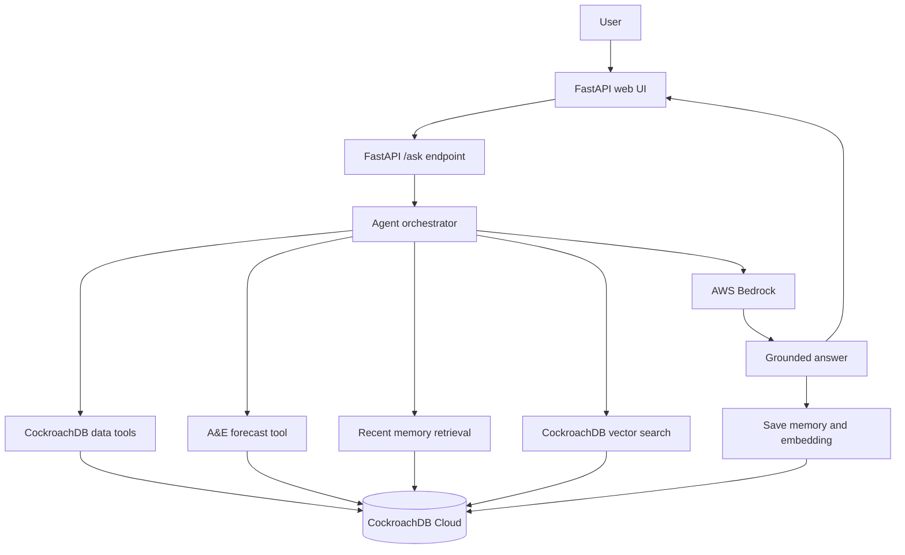

# NHS Capacity Memory Agent

Live demo: https://nhs-healthcare-capacity-ai.vercel.app

AWS Lambda demo: https://yul47sn53pnghl73lmiacl444u0jqoxt.lambda-url.us-east-1.on.aws/

NHS Capacity Memory Agent is a health operations decision-support prototype that helps users ask questions about NHS bed pressure, A&E demand, short-term pressure forecasts, and previous capacity discussions.

The system combines public NHS England datasets, CockroachDB Cloud, CockroachDB vector search, AWS Bedrock, and a FastAPI web app.

## What It Does

- answers operational questions about NHS capacity pressure
- identifies regional General and Acute bed occupancy patterns
- summarises recent A&E attendances and emergency admissions
- forecasts short-term A&E pressure using a simple linear trend
- stores previous questions and answers as agent memory
- generates Bedrock Titan embeddings for semantic memory search
- recalls similar previous questions through CockroachDB vector search
- exposes the experience through a deployed FastAPI app and web UI

## Live Product

Use the deployed app:

```text
https://nhs-healthcare-capacity-ai.vercel.app
```

AWS Lambda Function URL:

```text
https://yul47sn53pnghl73lmiacl444u0jqoxt.lambda-url.us-east-1.on.aws/
```

API health check:

```text
https://nhs-healthcare-capacity-ai.vercel.app/health
```

AWS Lambda health check:

```text
https://yul47sn53pnghl73lmiacl444u0jqoxt.lambda-url.us-east-1.on.aws/health
```

API documentation:

```text
https://nhs-healthcare-capacity-ai.vercel.app/docs
```

Example questions:

- Which region has the highest bed occupancy?
- Which region has the lowest bed occupancy?
- What is the likely A&E pressure trend over the next 3 months?
- What did I ask earlier about capacity pressure?

## Submission Materials

Submission support materials are included in `docs/`:

- Devpost submission text: `docs/DEVPOST_SUBMISSION.md`
- hackathon compliance: `docs/HACKATHON_COMPLIANCE.md`
- demo video script: `docs/DEMO_VIDEO_SCRIPT.md`
- screenshot checklist: `docs/SCREENSHOT_GUIDE.md`
- architecture notes: `docs/ARCHITECTURE.md`
- ERD: `docs/ERD.md`
- captured screenshots: `docs/demo_assets/`

## Architecture



## CockroachDB Usage

CockroachDB is used as the main data and memory layer:

- structured NHS capacity tables
- agent memory table
- vector embedding table
- semantic memory retrieval with vector search
- recommendation-ready schema

Hackathon tools used:

- CockroachDB Cloud
- CockroachDB Distributed Vector Indexing

Main tables:

- `capacity_snapshots`
- `beds_region_sector`
- `ae_activity`
- `agent_memory`
- `memory_embeddings`
- `recommendations`

See [docs/ERD.md](docs/ERD.md) for the database relationship diagram.

## AWS Bedrock Usage

AWS Bedrock is used for:

- answer generation through a hosted foundation model
- Bedrock Titan embeddings for vector memory

The agent retrieves capacity context from CockroachDB, sends that structured context to Bedrock, and stores the response back into CockroachDB memory.

## Data

The project uses public NHS England datasets:

- NHS England Bed Availability and Occupancy, Q3 2025-26
- NHS England Monthly A&E Attendances and Emergency Admissions, January 2026

Processed outputs:

- `data/processed/beds_region_sector_clean.csv`
- `data/processed/ae_activity_clean.csv`
- `data/processed/national_capacity_pressure.csv`

Loaded into CockroachDB:

- 1 national capacity pressure snapshot
- 8 regional bed pressure rows
- 186 A&E monthly activity rows

Current national signal:

- Period: December 2025
- General and Acute occupancy: 91.47%
- A&E attendances: 2.33 million
- Emergency admissions via A&E: 405,378
- Decision-to-admit waits over 12 hours: 50,775
- Prototype pressure score: 64.8
- Prototype risk band: elevated

## Forecasting

The A&E pressure forecast uses a simple linear trend over the latest 12 months of A&E data.

It is a product demonstration signal, not an official NHS forecast.

Forecast output includes:

- A&E total attendances
- emergency admissions via A&E
- decision-to-admit waits over 12 hours

## Local Setup

Create a private `.env` file locally:

```text
DATABASE_URL=your_cockroachdb_connection_string
AWS_REGION=us-east-1
EMBEDDING_PROVIDER=bedrock
EMBEDDING_MODEL=amazon.titan-embed-text-v2:0
BEDROCK_TEXT_MODEL=amazon.nova-pro-v1:0
```

Never commit `.env` to GitHub.

Install dependencies:

```powershell
C:\Users\folah\my_python_projects\venv\Scripts\python.exe -m pip install -r requirements.txt
```

Run locally:

```powershell
C:\Users\folah\my_python_projects\venv\Scripts\python.exe -m uvicorn app.main:app --reload
```

Open:

```text
http://127.0.0.1:8000
```

## Useful Scripts

```powershell
C:\Users\folah\my_python_projects\venv\Scripts\python.exe scripts\test_db_connection.py
C:\Users\folah\my_python_projects\venv\Scripts\python.exe scripts\load_nhs_datasets.py
C:\Users\folah\my_python_projects\venv\Scripts\python.exe scripts\test_vector_memory.py
C:\Users\folah\my_python_projects\venv\Scripts\python.exe scripts\test_forecasting.py
C:\Users\folah\my_python_projects\venv\Scripts\python.exe scripts\ask_bedrock_capacity_agent.py
```

## Project Documentation

- [Architecture](docs/ARCHITECTURE.md)
- [ERD](docs/ERD.md)
- [Data Dictionary](docs/DATA_DICTIONARY.md)
- [Deployment Guide](docs/DEPLOYMENT.md)
- [Devpost Submission](docs/DEVPOST_SUBMISSION.md)
- [Demo Video Script](docs/DEMO_VIDEO_SCRIPT.md)

## Status

Complete for hackathon demo:

- CockroachDB Cloud schema
- NHS data loading
- duplicate-safe loading
- Bedrock answer generation
- Bedrock embeddings
- CockroachDB vector memory
- A&E pressure forecasting
- FastAPI API
- deployed Vercel web app
- deployed AWS Lambda Function URL

Next improvements:

- richer forecasting method
- role-based recommendation engine
- more NHS datasets
- dashboard charts
- authentication for real operational use

## License

This project is licensed under the MIT License. See [LICENSE](LICENSE).
