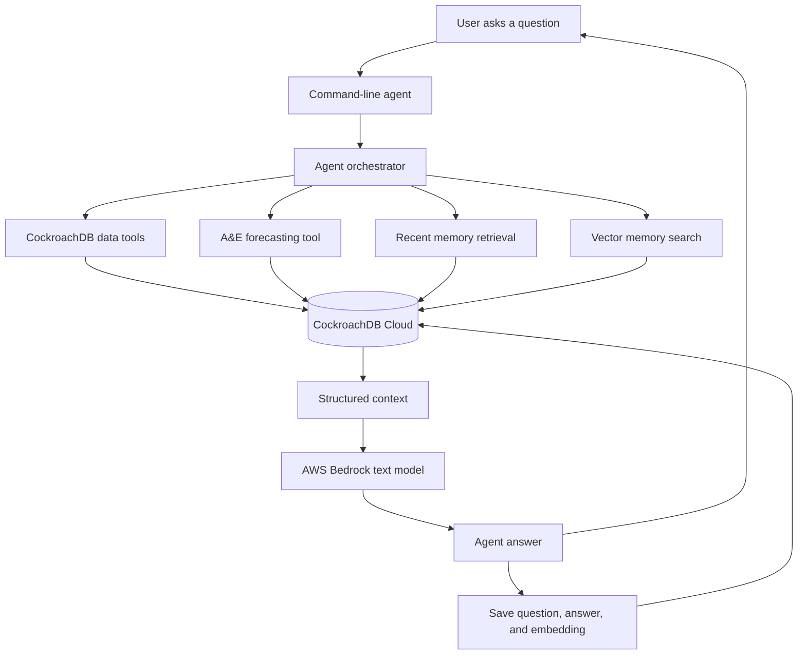
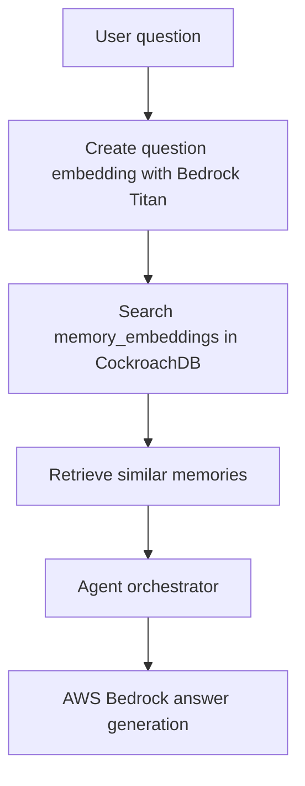
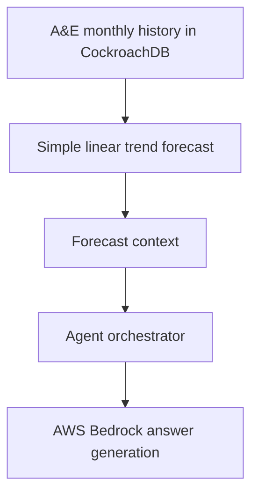

# NHS Capacity Memory Agent Architecture

This document explains how the system works from user question to final answer.

## System Flow

## Current Implementation

The current project uses a simple agent orchestrator instead of a full LangGraph workflow.

The orchestrator does six main things:

1. Reads NHS capacity data from CockroachDB.
2. Builds a simple A&E pressure forecast from recent monthly history.
3. Reads recent agent memory from CockroachDB.
4. Runs vector memory search to find semantically similar previous questions.
5. Sends the user question and database context to AWS Bedrock.
6. Saves the answer back into CockroachDB memory with an embedding.

## Main Components

`agent/db.py` connects Python to CockroachDB using `DATABASE_URL` from `.env`.

`agent/tools.py` contains database tools for capacity summary, regional bed pressure, A&E history, and A&E trend.

`agent/forecasting.py` creates a simple linear A&E pressure forecast.

`agent/embeddings.py` creates Bedrock Titan embeddings for text.

`agent/memory.py` saves memory, stores memory embeddings, and retrieves similar memories with CockroachDB vector search.

`agent/bedrock_client.py` sends prompts to AWS Bedrock.

`agent/orchestrator.py` coordinates the tools, memory, Bedrock response, and final memory save.

`scripts/ask_bedrock_capacity_agent.py` is the command-line entry point for asking the agent questions.

## Vector Memory Flow

Vector memory allows the agent to remember meaning, not only exact words.

## Forecasting Flow

The forecast is a simple trend estimate for product demonstration. It is not an official NHS prediction.
