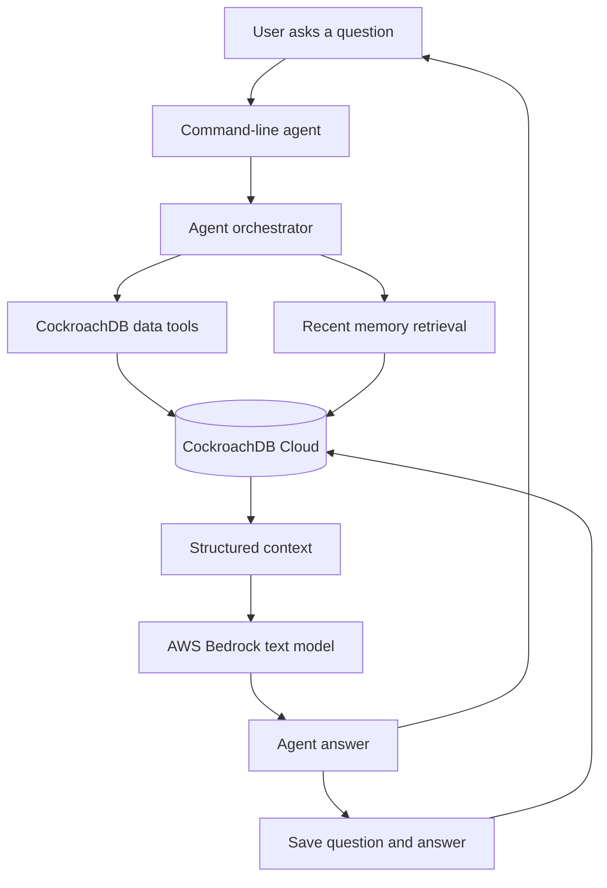
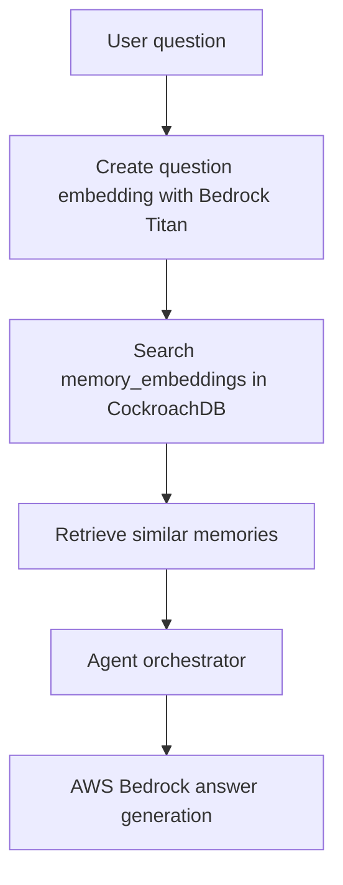

# NHS Capacity Memory Agent Architecture

This document explains how the system works from user question to final answer.

## System Flow

## Current Implementation

The current project uses a simple agent orchestrator instead of a full LangGraph workflow.

The orchestrator does four main things:

1. Reads NHS capacity data from CockroachDB.
2. Reads recent agent memory from CockroachDB.
3. Sends the user question and database context to AWS Bedrock.
4. Saves the answer back into CockroachDB memory.

## Main Components

`agent/db.py` connects Python to CockroachDB using `DATABASE_URL` from `.env`.

`agent/tools.py` contains database tools for capacity summary, regional bed pressure, A&E history, and A&E trend.

`agent/memory.py` saves and retrieves agent memory.

`agent/bedrock_client.py` sends prompts to AWS Bedrock.

`agent/orchestrator.py` coordinates the tools, memory, Bedrock response, and final memory save.

`scripts/ask_bedrock_capacity_agent.py` is the command-line entry point for asking the agent questions.

## Planned Upgrade

The next major upgrade is vector memory.

Vector memory will add this flow:

This will let the agent remember meaning, not only exact words.
