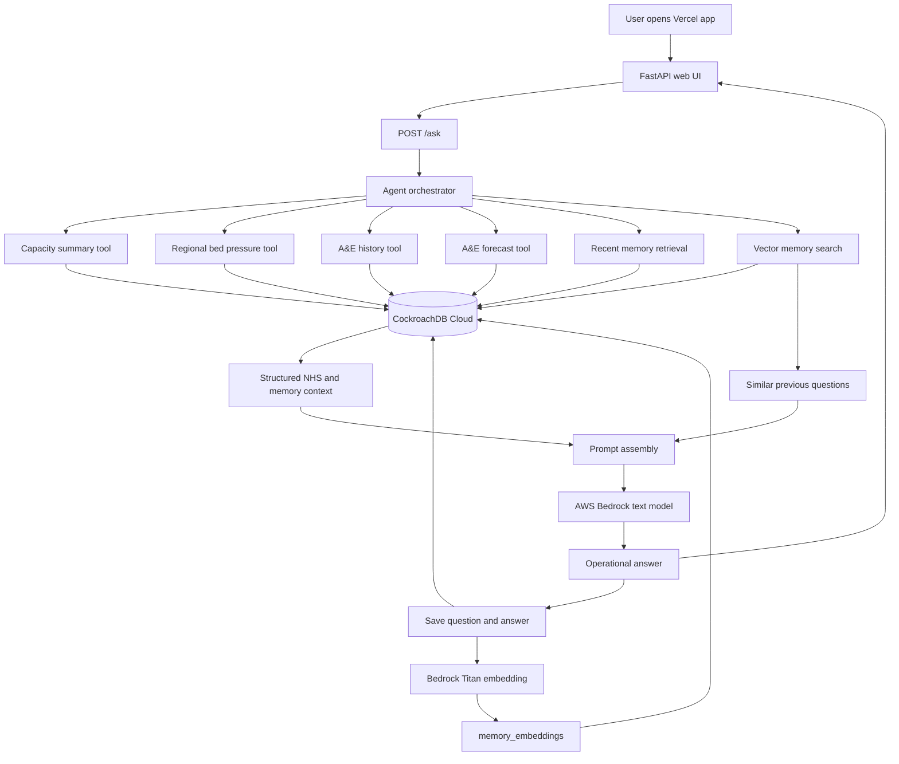
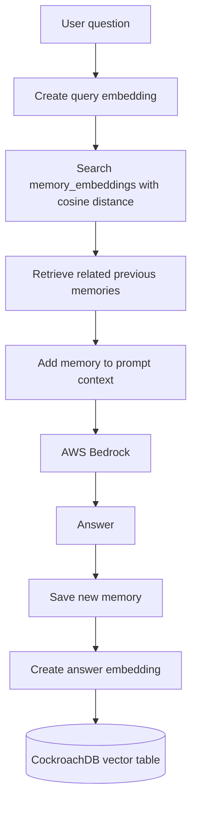
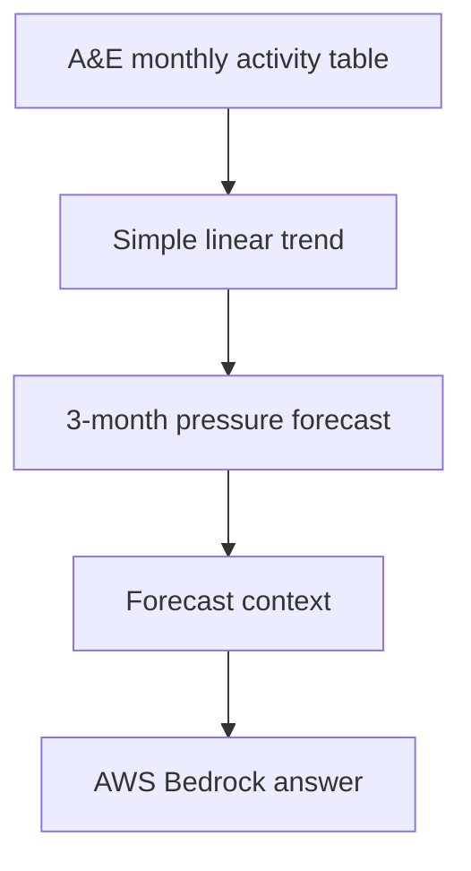

# NHS Capacity Memory Agent Architecture

This document explains the deployed system from user question to saved memory.

## Production Flow



## Components

`app/main.py`

FastAPI application. It serves the web UI, exposes `/health`, exposes `/signals`, and accepts user questions through `/ask`.

`app/static/index.html`

The deployed product interface. Users can ask capacity, A&E, forecast, and memory questions.

`agent/orchestrator.py`

Coordinates retrieval, forecasting, memory search, Bedrock answer generation, and memory saving.

`agent/tools.py`

Contains CockroachDB data tools for:

- national capacity summary
- regional bed pressure
- A&E activity history
- A&E time trend

`agent/forecasting.py`

Creates a simple 3-month A&E pressure forecast using recent monthly history.

`agent/memory.py`

Stores user questions and agent answers. It also retrieves recent memories and similar memories.

`agent/embeddings.py`

Creates Bedrock Titan vector embeddings and formats them for CockroachDB vector search.

`agent/bedrock_client.py`

Connects to AWS Bedrock for text generation and embedding generation.

`agent/db.py`

Connects to CockroachDB using private environment variables.

## Database Role

CockroachDB is the persistent intelligence layer.

It stores:

- capacity data
- regional bed pressure
- A&E activity
- agent memory
- vector embeddings
- recommendation-ready records

## Memory Flow



## Forecasting Flow



The forecast is a prototype decision-support signal. It is not an official NHS prediction.

## Deployment

The app is deployed on Vercel:

```text
https://nhs-healthcare-capacity-ai.vercel.app
```

Vercel stores deployment secrets as private environment variables:

- `DATABASE_URL`
- `AWS_ACCESS_KEY_ID`
- `AWS_SECRET_ACCESS_KEY`
- `AWS_REGION`
- `EMBEDDING_PROVIDER`
- `EMBEDDING_MODEL`
- `BEDROCK_TEXT_MODEL`

The local `.env` file is ignored by Git and must never be committed.
