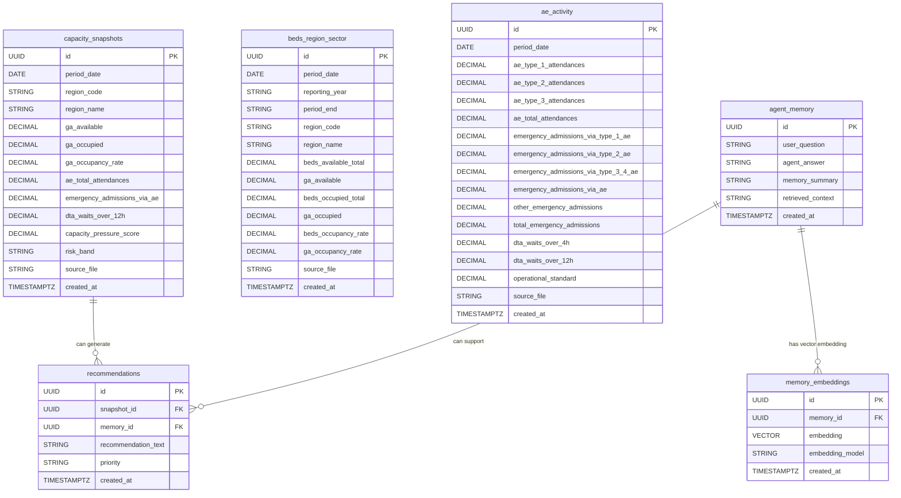

# NHS Capacity Memory Agent ERD

This document shows how the CockroachDB tables relate to each other. It uses the industry-friendly crow's foot ERD style through Mermaid, which is easier to read in GitHub than the older academic Chen notation.

## Entity Relationship Diagram

## Simple Explanation

`capacity_snapshots` stores the high-level national capacity pressure view.

`beds_region_sector` stores regional General and Acute bed pressure, so the agent can answer questions like which region has the highest occupancy.

`ae_activity` stores monthly A&E attendances, admissions, and delay-to-admission waits, so the agent can answer trend questions.

`agent_memory` stores what users asked and what the agent answered.

`memory_embeddings` stores vector versions of memories. This allows semantic memory search, meaning the agent can find related memories even when the wording is different.

`recommendations` stores operational recommendations produced from NHS pressure signals and agent context.

## Relationship Notes

`memory_embeddings.memory_id` links each embedding back to one row in `agent_memory`.

`recommendations.snapshot_id` can link a recommendation to a capacity snapshot.

`recommendations.memory_id` can link a recommendation to the conversation memory that helped produce it.

The NHS data tables are not directly joined with foreign keys because the source files are monthly summary datasets. They are connected analytically through fields like `period_date`, `region_code`, and `region_name`.
